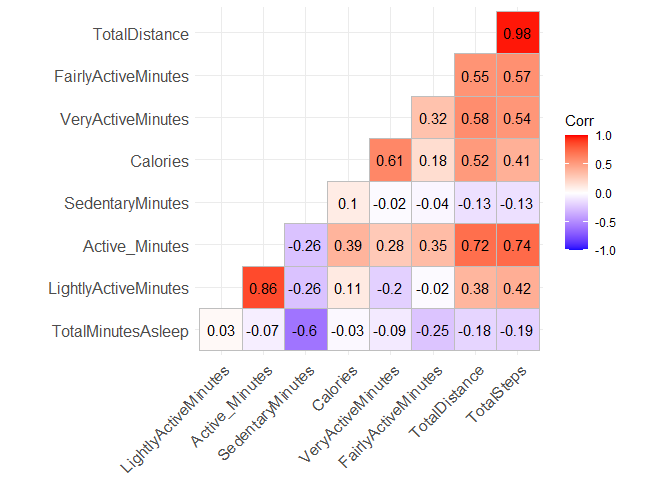
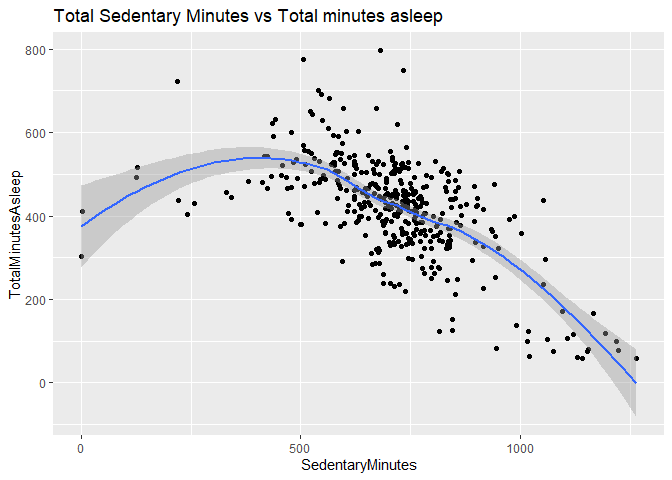
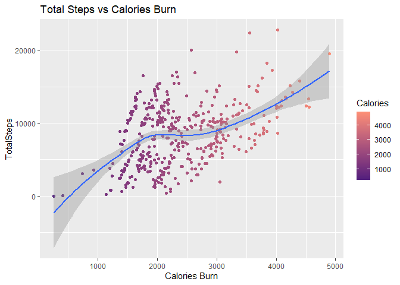
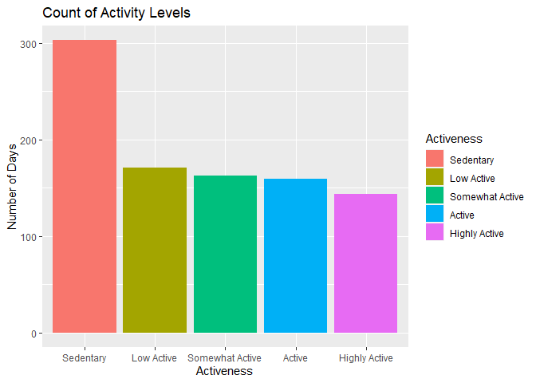
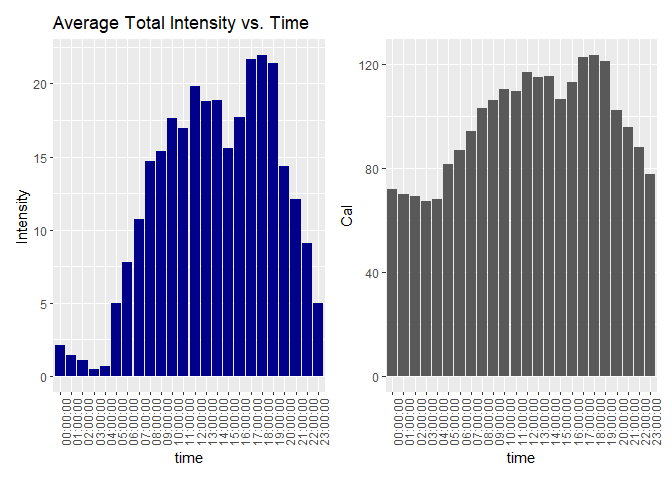
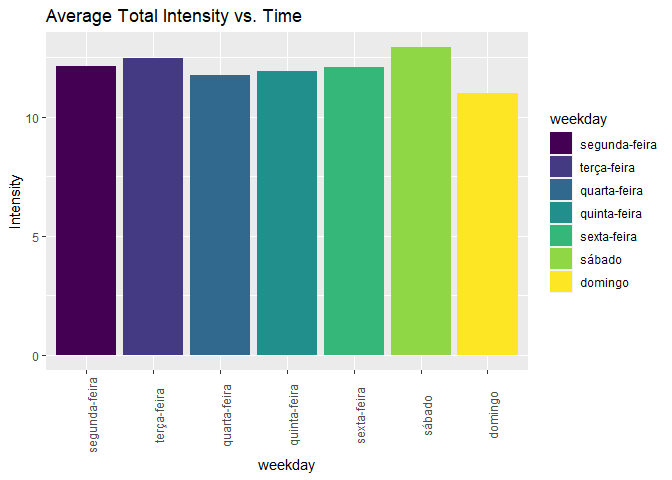
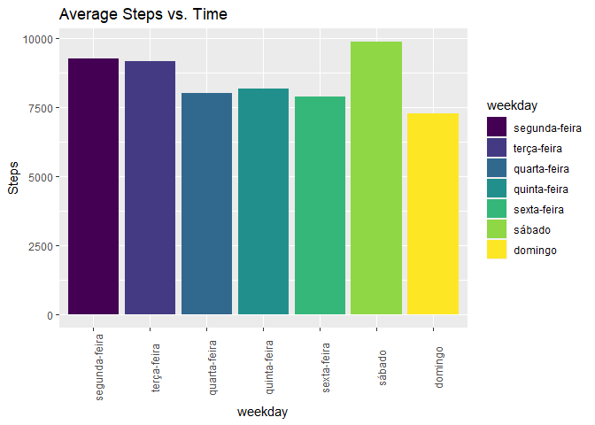
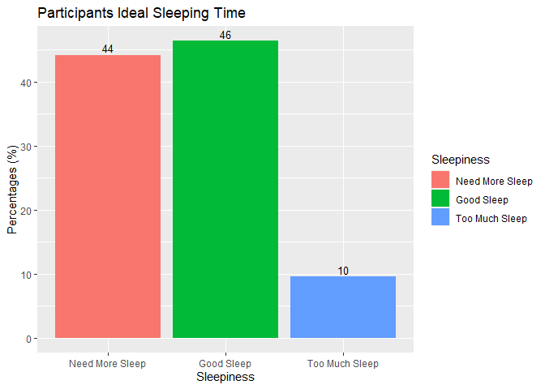

Bellabeat Case Study with R
================
Henrique Almeida
13/01/2022

This project has been done as a capstone project for the Google Data
Analytics course, completed at Coursera. The goal is to analyze a public
data from fitness tracker smart devices in order to support the
marketing strategy of Bellabeat, a high-tech manufacturer of
health-focused products for women.

**Table of contents**

- [Business Task](#business-task)
- [Data acquisition](#data-acquisition)
- [Data cleaning](#data-cleaning)
- [Data exploration](#data-exploration)
- [Data visualization](#data-visualization)
- [Key findings & recommendations](#key-findings-and-recommendations)

## Summary

For this project, I’m playing the role of a junior data analyst working
on the marketing analyst team at Bellabeat, a high-tech manufacturer of
health-focused products for women. Bellabeat is a successful small
company, but they have the potential to become a larger player in the
global smart device market. Urška Sršen, cofounder and Chief Creative
Officer of Bellabeat, believes that analyzing smart device fitness data
could help unlock new growth opportunities for the company. You have
been asked to focus on one of Bellabeat’s products and analyze smart
device data to gain insight into how consumers are using their smart
devices. The insights you discover will then help guide marketing
strategy for the company.

# Business task

Analyze smart device usage public data in order to gain insight into how
consumers use non-Bellabeat smart devices, in order to drive
recommendations to support Bellabeat’s marketing strategy. Some guiding
questions:

1.  What are some trends in smart device usage?
2.  How could these trends apply to Bellabeat customers?
3.  How could these trends help influence Bellabeat marketing strategy?

If we can understand how the target audience uses health trackers and
smart devices from other companies, we can draft marketing strategies
that focus on the most using patterns, common situations, main pain
points, and so on.

## Data acquisition

First let’s install the necessary packages to work with the datasets:

Loading the packages:

``` r
library(tidyverse)
```

    ## -- Attaching packages --------------------------------------- tidyverse 1.3.1 --

    ## v ggplot2 3.3.5     v purrr   0.3.4
    ## v tibble  3.1.6     v dplyr   1.0.7
    ## v tidyr   1.1.4     v stringr 1.4.0
    ## v readr   2.1.1     v forcats 0.5.1

    ## -- Conflicts ------------------------------------------ tidyverse_conflicts() --
    ## x dplyr::filter() masks stats::filter()
    ## x dplyr::lag()    masks stats::lag()

``` r
library(lubridate)
```

    ## 
    ## Attaching package: 'lubridate'

    ## The following objects are masked from 'package:base':
    ## 
    ##     date, intersect, setdiff, union

``` r
library(skimr)
library(ggcorrplot)
library(patchwork)
```

For this project, I’m using Fitbit Fitness Tracker data, available at
<https://www.kaggle.com/arashnic/fitbit> . Loading the data:

``` r
daily_activity <- read_csv("Fitabase Data 4.12.16-5.12.16/dailyActivity_merged.csv")
```

    ## Rows: 940 Columns: 15

    ## -- Column specification --------------------------------------------------------
    ## Delimiter: ","
    ## chr  (1): ActivityDate
    ## dbl (14): Id, TotalSteps, TotalDistance, TrackerDistance, LoggedActivitiesDi...

    ## 
    ## i Use `spec()` to retrieve the full column specification for this data.
    ## i Specify the column types or set `show_col_types = FALSE` to quiet this message.

``` r
hourly_calories <- read_csv("Fitabase Data 4.12.16-5.12.16/hourlyCalories_merged.csv")
```

    ## Rows: 22099 Columns: 3

    ## -- Column specification --------------------------------------------------------
    ## Delimiter: ","
    ## chr (1): ActivityHour
    ## dbl (2): Id, Calories

    ## 
    ## i Use `spec()` to retrieve the full column specification for this data.
    ## i Specify the column types or set `show_col_types = FALSE` to quiet this message.

``` r
hourly_intensities <- read_csv("Fitabase Data 4.12.16-5.12.16/hourlyIntensities_merged.csv")
```

    ## Rows: 22099 Columns: 4

    ## -- Column specification --------------------------------------------------------
    ## Delimiter: ","
    ## chr (1): ActivityHour
    ## dbl (3): Id, TotalIntensity, AverageIntensity

    ## 
    ## i Use `spec()` to retrieve the full column specification for this data.
    ## i Specify the column types or set `show_col_types = FALSE` to quiet this message.

``` r
sleep_day <- read_csv("Fitabase Data 4.12.16-5.12.16/sleepDay_merged.csv")
```

    ## Rows: 413 Columns: 5

    ## -- Column specification --------------------------------------------------------
    ## Delimiter: ","
    ## chr (1): SleepDay
    ## dbl (4): Id, TotalSleepRecords, TotalMinutesAsleep, TotalTimeInBed

    ## 
    ## i Use `spec()` to retrieve the full column specification for this data.
    ## i Specify the column types or set `show_col_types = FALSE` to quiet this message.

``` r
weight_info <- read_csv("Fitabase Data 4.12.16-5.12.16/weightLogInfo_merged.csv")
```

    ## Rows: 67 Columns: 8

    ## -- Column specification --------------------------------------------------------
    ## Delimiter: ","
    ## chr (1): Date
    ## dbl (6): Id, WeightKg, WeightPounds, Fat, BMI, LogId
    ## lgl (1): IsManualReport

    ## 
    ## i Use `spec()` to retrieve the full column specification for this data.
    ## i Specify the column types or set `show_col_types = FALSE` to quiet this message.

## Data Cleaning

Let’s take a look at the data first:

``` r
glimpse(daily_activity)
```

    ## Rows: 940
    ## Columns: 15
    ## $ Id                       <dbl> 1503960366, 1503960366, 1503960366, 150396036~
    ## $ ActivityDate             <chr> "4/12/2016", "4/13/2016", "4/14/2016", "4/15/~
    ## $ TotalSteps               <dbl> 13162, 10735, 10460, 9762, 12669, 9705, 13019~
    ## $ TotalDistance            <dbl> 8.50, 6.97, 6.74, 6.28, 8.16, 6.48, 8.59, 9.8~
    ## $ TrackerDistance          <dbl> 8.50, 6.97, 6.74, 6.28, 8.16, 6.48, 8.59, 9.8~
    ## $ LoggedActivitiesDistance <dbl> 0, 0, 0, 0, 0, 0, 0, 0, 0, 0, 0, 0, 0, 0, 0, ~
    ## $ VeryActiveDistance       <dbl> 1.88, 1.57, 2.44, 2.14, 2.71, 3.19, 3.25, 3.5~
    ## $ ModeratelyActiveDistance <dbl> 0.55, 0.69, 0.40, 1.26, 0.41, 0.78, 0.64, 1.3~
    ## $ LightActiveDistance      <dbl> 6.06, 4.71, 3.91, 2.83, 5.04, 2.51, 4.71, 5.0~
    ## $ SedentaryActiveDistance  <dbl> 0, 0, 0, 0, 0, 0, 0, 0, 0, 0, 0, 0, 0, 0, 0, ~
    ## $ VeryActiveMinutes        <dbl> 25, 21, 30, 29, 36, 38, 42, 50, 28, 19, 66, 4~
    ## $ FairlyActiveMinutes      <dbl> 13, 19, 11, 34, 10, 20, 16, 31, 12, 8, 27, 21~
    ## $ LightlyActiveMinutes     <dbl> 328, 217, 181, 209, 221, 164, 233, 264, 205, ~
    ## $ SedentaryMinutes         <dbl> 728, 776, 1218, 726, 773, 539, 1149, 775, 818~
    ## $ Calories                 <dbl> 1985, 1797, 1776, 1745, 1863, 1728, 1921, 203~

``` r
glimpse(sleep_day)
```

    ## Rows: 413
    ## Columns: 5
    ## $ Id                 <dbl> 1503960366, 1503960366, 1503960366, 1503960366, 150~
    ## $ SleepDay           <chr> "4/12/2016 12:00:00 AM", "4/13/2016 12:00:00 AM", "~
    ## $ TotalSleepRecords  <dbl> 1, 2, 1, 2, 1, 1, 1, 1, 1, 1, 1, 1, 1, 1, 1, 1, 1, ~
    ## $ TotalMinutesAsleep <dbl> 327, 384, 412, 340, 700, 304, 360, 325, 361, 430, 2~
    ## $ TotalTimeInBed     <dbl> 346, 407, 442, 367, 712, 320, 377, 364, 384, 449, 3~

``` r
glimpse(hourly_calories)
```

    ## Rows: 22,099
    ## Columns: 3
    ## $ Id           <dbl> 1503960366, 1503960366, 1503960366, 1503960366, 150396036~
    ## $ ActivityHour <chr> "4/12/2016 12:00:00 AM", "4/12/2016 1:00:00 AM", "4/12/20~
    ## $ Calories     <dbl> 81, 61, 59, 47, 48, 48, 48, 47, 68, 141, 99, 76, 73, 66, ~

``` r
glimpse(hourly_intensities)
```

    ## Rows: 22,099
    ## Columns: 4
    ## $ Id               <dbl> 1503960366, 1503960366, 1503960366, 1503960366, 15039~
    ## $ ActivityHour     <chr> "4/12/2016 12:00:00 AM", "4/12/2016 1:00:00 AM", "4/1~
    ## $ TotalIntensity   <dbl> 20, 8, 7, 0, 0, 0, 0, 0, 13, 30, 29, 12, 11, 6, 36, 5~
    ## $ AverageIntensity <dbl> 0.333333, 0.133333, 0.116667, 0.000000, 0.000000, 0.0~

``` r
glimpse(weight_info)
```

    ## Rows: 67
    ## Columns: 8
    ## $ Id             <dbl> 1503960366, 1503960366, 1927972279, 2873212765, 2873212~
    ## $ Date           <chr> "5/2/2016 11:59:59 PM", "5/3/2016 11:59:59 PM", "4/13/2~
    ## $ WeightKg       <dbl> 52.6, 52.6, 133.5, 56.7, 57.3, 72.4, 72.3, 69.7, 70.3, ~
    ## $ WeightPounds   <dbl> 115.9631, 115.9631, 294.3171, 125.0021, 126.3249, 159.6~
    ## $ Fat            <dbl> 22, NA, NA, NA, NA, 25, NA, NA, NA, NA, NA, NA, NA, NA,~
    ## $ BMI            <dbl> 22.65, 22.65, 47.54, 21.45, 21.69, 27.45, 27.38, 27.25,~
    ## $ IsManualReport <lgl> TRUE, TRUE, FALSE, TRUE, TRUE, TRUE, TRUE, TRUE, TRUE, ~
    ## $ LogId          <dbl> 1.462234e+12, 1.462320e+12, 1.460510e+12, 1.461283e+12,~

We can see that all dates columns were imported as characters, so we
need to fix the formatting:

``` r
# daily activity
daily_activity$date <- as.Date(daily_activity$ActivityDate, format = "%m/%d/%Y")


# sleep day
sleep_day$date <- as.Date(sleep_day$SleepDay, format = "%m/%d/%Y")

#hourly intensities
hourly_intensities$ActivityHour=as.POSIXct(hourly_intensities$ActivityHour, format="%m/%d/%Y %I:%M:%S %p", tz=Sys.timezone())

#hourly calories
hourly_calories$ActivityHour=as.POSIXct(hourly_calories$ActivityHour, format="%m/%d/%Y %I:%M:%S %p", tz=Sys.timezone())
```

### Checcking for Duplicates

Let’s check if the data sets contain any duplicate rows:

``` r
nrow(distinct(daily_activity))
```

    ## [1] 940

``` r
nrow(distinct(sleep_day))
```

    ## [1] 410

``` r
nrow(distinct(hourly_calories))
```

    ## [1] 22099

``` r
nrow(distinct(hourly_intensities))
```

    ## [1] 22099

``` r
nrow(distinct(weight_info))
```

    ## [1] 67

We can see that sleep day have 410 distinct rows, while the dataset
shows 413 observations. Let’s remove the duplicates:

``` r
sleep_day <- distinct(sleep_day)
```

### Checking missing values

``` r
sum(is.na(daily_activity))
```

    ## [1] 0

``` r
sum(is.na(sleep_day))
```

    ## [1] 0

``` r
sum(is.na(hourly_calories))
```

    ## [1] 0

``` r
sum(is.na(hourly_intensities))
```

    ## [1] 0

``` r
sum(is.na(weight_info))
```

    ## [1] 65

We see that weight_info has 65 missing values. Investigating the
dataset, we see that there is missing information about Fat percentages,
so this information will not be used in the analysis.

## Data exploration

Let’s first get some summary statistics about the data, and see if we
can get any insights from it.

``` r
# activity
daily_activity %>%  
  select(TotalSteps,
         TotalDistance,
         Calories) %>%
  summary()
```

    ##    TotalSteps    TotalDistance       Calories   
    ##  Min.   :    0   Min.   : 0.000   Min.   :   0  
    ##  1st Qu.: 3790   1st Qu.: 2.620   1st Qu.:1828  
    ##  Median : 7406   Median : 5.245   Median :2134  
    ##  Mean   : 7638   Mean   : 5.490   Mean   :2304  
    ##  3rd Qu.:10727   3rd Qu.: 7.713   3rd Qu.:2793  
    ##  Max.   :36019   Max.   :28.030   Max.   :4900

``` r
# explore num of active minutes per category
daily_activity %>%
  select(VeryActiveMinutes,
         FairlyActiveMinutes,
         LightlyActiveMinutes,
         SedentaryMinutes) %>%
  summary()
```

    ##  VeryActiveMinutes FairlyActiveMinutes LightlyActiveMinutes SedentaryMinutes
    ##  Min.   :  0.00    Min.   :  0.00      Min.   :  0.0        Min.   :   0.0  
    ##  1st Qu.:  0.00    1st Qu.:  0.00      1st Qu.:127.0        1st Qu.: 729.8  
    ##  Median :  4.00    Median :  6.00      Median :199.0        Median :1057.5  
    ##  Mean   : 21.16    Mean   : 13.56      Mean   :192.8        Mean   : 991.2  
    ##  3rd Qu.: 32.00    3rd Qu.: 19.00      3rd Qu.:264.0        3rd Qu.:1229.5  
    ##  Max.   :210.00    Max.   :143.00      Max.   :518.0        Max.   :1440.0

``` r
# intensities
hourly_intensities %>% 
  select(TotalIntensity, AverageIntensity) %>% 
  summary()
```

    ##  TotalIntensity   AverageIntensity
    ##  Min.   :  0.00   Min.   :0.0000  
    ##  1st Qu.:  0.00   1st Qu.:0.0000  
    ##  Median :  3.00   Median :0.0500  
    ##  Mean   : 12.04   Mean   :0.2006  
    ##  3rd Qu.: 16.00   3rd Qu.:0.2667  
    ##  Max.   :180.00   Max.   :3.0000

``` r
# calories
hourly_calories %>%
  select(Calories) %>%
  summary()
```

    ##     Calories     
    ##  Min.   : 42.00  
    ##  1st Qu.: 63.00  
    ##  Median : 83.00  
    ##  Mean   : 97.39  
    ##  3rd Qu.:108.00  
    ##  Max.   :948.00

``` r
# sleep
sleep_day %>%
  select(TotalSleepRecords, TotalMinutesAsleep, TotalTimeInBed) %>%
  summary()
```

    ##  TotalSleepRecords TotalMinutesAsleep TotalTimeInBed 
    ##  Min.   :1.00      Min.   : 58.0      Min.   : 61.0  
    ##  1st Qu.:1.00      1st Qu.:361.0      1st Qu.:403.8  
    ##  Median :1.00      Median :432.5      Median :463.0  
    ##  Mean   :1.12      Mean   :419.2      Mean   :458.5  
    ##  3rd Qu.:1.00      3rd Qu.:490.0      3rd Qu.:526.0  
    ##  Max.   :3.00      Max.   :796.0      Max.   :961.0

``` r
# weight
weight_info %>%
  select(WeightKg, BMI) %>%
  summary()
```

    ##     WeightKg           BMI       
    ##  Min.   : 52.60   Min.   :21.45  
    ##  1st Qu.: 61.40   1st Qu.:23.96  
    ##  Median : 62.50   Median :24.39  
    ##  Mean   : 72.04   Mean   :25.19  
    ##  3rd Qu.: 85.05   3rd Qu.:25.56  
    ##  Max.   :133.50   Max.   :47.54

Some first insights about the data:

-   The average nº of steps per day is 7638, which is 24% below the
    10,000 steps recommended. (For general fitness, most adults should
    aim for 10,000 steps per day. This figure may rise or fall depending
    on a person’s age, current fitness level, and health goals. This
    recommendation comes from the Centers for Disease Control and
    Prevention (CDC) )
-   The average sedentary time per day is 16h30 min, which can mean 2
    things: the users are very sedentary people, or the threshold of
    sedentary activity on the smart devices do not represent reality and
    could be better calibrated
-   The average time asleep is 6h50min, and total time in bed 7h40 min.
    If we consider 8h of sleep per day as recommendation, we see that
    the user are not sleeping as much as they should. We can try to
    understand what factors can influence the time asleep, and possibly
    the sleep quality.

Now let’s see the number of different participants in each data sets.

``` r
n_distinct(daily_activity$Id)
```

    ## [1] 33

``` r
n_distinct(sleep_day$Id)
```

    ## [1] 24

``` r
n_distinct(hourly_calories$Id)
```

    ## [1] 33

``` r
n_distinct(hourly_intensities$Id)
```

    ## [1] 33

``` r
n_distinct(weight_info$Id)
```

    ## [1] 8

There are 33 users for the daily activity and hourly calories &
intensities, and only 24 for sleep and 8 for weight.

In order to better prepare the data for analysis, we will add more
columns :

-   Adding “weekday” to look for patterns along the week
-   Adding “time” to `hourly_intensities` and `hourly_calories` to
    separate the hours from datetime
-   Adding “activeness” column to `daily_activity` based on the nº of
    steps taken that day. The activeness levels were determined based on
    <https://www.medicinenet.com/how_many_steps_a_day_is_considered_active/article.htm>.
-   Adding “sleepness” to `sleep_day` to classify sleep time.

``` r
hourly_intensities <- hourly_intensities %>% 
  mutate(weekday = weekdays(ActivityHour)) %>% 
  mutate(time = format(ActivityHour, format = "%H:%M:%M"))

hourly_calories <- hourly_calories %>% 
  mutate(weekday = weekdays(ActivityHour)) %>% 
  mutate(time = format(ActivityHour, format = "%H:%M:%M"))


daily_activity <- daily_activity %>% 
  mutate(weekday = weekdays(date))


daily_activity <- daily_activity %>% 
  mutate(Activeness = case_when(.$TotalSteps < 5000 ~ "Sedentary",
                                .$TotalSteps < 7499 ~ "Low Active",
                                .$TotalSteps < 9999 ~ "Somewhat Active",
                                .$TotalSteps < 12500 ~ "Active",
                                .$TotalSteps >= 12500 ~ "Highly Active"))

sleep_day <- sleep_day %>%
  mutate(Sleepiness = case_when(.$TotalMinutesAsleep < 420 ~ "Need More Sleep",
                                .$TotalMinutesAsleep >= 420 & TotalMinutesAsleep < 540 ~ "Good Sleep",
                                .$TotalMinutesAsleep >= 540 ~ "Too Much Sleep"))
```

### Merging the data

We will merge the data of daily activity and sleep, and see if they
represent data about the same users.

``` r
merged_data <- inner_join(sleep_day, daily_activity, by=c('Id', 'date'))
glimpse(merged_data)
```

    ## Rows: 410
    ## Columns: 23
    ## $ Id                       <dbl> 1503960366, 1503960366, 1503960366, 150396036~
    ## $ SleepDay                 <chr> "4/12/2016 12:00:00 AM", "4/13/2016 12:00:00 ~
    ## $ TotalSleepRecords        <dbl> 1, 2, 1, 2, 1, 1, 1, 1, 1, 1, 1, 1, 1, 1, 1, ~
    ## $ TotalMinutesAsleep       <dbl> 327, 384, 412, 340, 700, 304, 360, 325, 361, ~
    ## $ TotalTimeInBed           <dbl> 346, 407, 442, 367, 712, 320, 377, 364, 384, ~
    ## $ date                     <date> 2016-04-12, 2016-04-13, 2016-04-15, 2016-04-~
    ## $ Sleepiness               <chr> "Need More Sleep", "Need More Sleep", "Need M~
    ## $ ActivityDate             <chr> "4/12/2016", "4/13/2016", "4/15/2016", "4/16/~
    ## $ TotalSteps               <dbl> 13162, 10735, 9762, 12669, 9705, 15506, 10544~
    ## $ TotalDistance            <dbl> 8.50, 6.97, 6.28, 8.16, 6.48, 9.88, 6.68, 6.3~
    ## $ TrackerDistance          <dbl> 8.50, 6.97, 6.28, 8.16, 6.48, 9.88, 6.68, 6.3~
    ## $ LoggedActivitiesDistance <dbl> 0, 0, 0, 0, 0, 0, 0, 0, 0, 0, 0, 0, 0, 0, 0, ~
    ## $ VeryActiveDistance       <dbl> 1.88, 1.57, 2.14, 2.71, 3.19, 3.53, 1.96, 1.3~
    ## $ ModeratelyActiveDistance <dbl> 0.55, 0.69, 1.26, 0.41, 0.78, 1.32, 0.48, 0.3~
    ## $ LightActiveDistance      <dbl> 6.06, 4.71, 2.83, 5.04, 2.51, 5.03, 4.24, 4.6~
    ## $ SedentaryActiveDistance  <dbl> 0, 0, 0, 0, 0, 0, 0, 0, 0, 0, 0, 0, 0, 0, 0, ~
    ## $ VeryActiveMinutes        <dbl> 25, 21, 29, 36, 38, 50, 28, 19, 41, 39, 73, 3~
    ## $ FairlyActiveMinutes      <dbl> 13, 19, 34, 10, 20, 31, 12, 8, 21, 5, 14, 23,~
    ## $ LightlyActiveMinutes     <dbl> 328, 217, 209, 221, 164, 264, 205, 211, 262, ~
    ## $ SedentaryMinutes         <dbl> 728, 776, 726, 773, 539, 775, 818, 838, 732, ~
    ## $ Calories                 <dbl> 1985, 1797, 1745, 1863, 1728, 2035, 1786, 177~
    ## $ weekday                  <chr> "terça-feira", "quarta-feira", "sexta-feira",~
    ## $ Activeness               <chr> "Highly Active", "Active", "Somewhat Active",~

Now let’s see the distinct Id’s:

``` r
n_distinct(merged_data$Id)
```

    ## [1] 24

There are 24 unique users, so we have data about daily activity and
sleep of those 24 users!

We will ad more columns to the merged data set in order to better
analyze the information:

## Data Visualization

Let’s start to see the data in charts to better understand it.

We will first analyze the correlation between the variables in the
merged data with the `ggcorrplot` package.

``` r
cor1 <- merged_data %>%
  summarise(
         TotalMinutesAsleep,
         Calories,
         TotalDistance,
         TotalSteps,
         LightlyActiveMinutes,
         FairlyActiveMinutes,
         VeryActiveMinutes,
         Active_Minutes = LightlyActiveMinutes + FairlyActiveMinutes + VeryActiveMinutes,
         SedentaryMinutes) %>% 
  cor()

ggcorrplot(cor1, hc.order = TRUE, type = "lower", lab = TRUE)
```

<!-- -->
From this analysis, we can take some conclusions:

-   The total distance is very positive correlated to total steps, which
    was already expected
-   The lightly active minutes make the most part of the active minutes
    taken by people
-   the only variable that significantly correlates to the total minutes
    asleep is sedentary minutes, with a negative correlation

Let’s investigate better the correlation between sedentary minutes and
minutes asleep.

``` r
ggplot(data = merged_data, aes(x = SedentaryMinutes, y = TotalMinutesAsleep)) + geom_point() + geom_smooth(method = "loess") + labs(title = "Total Sedentary Minutes vs Total minutes asleep")
```

    ## `geom_smooth()` using formula 'y ~ x'

<!-- -->
We can see that there is a negative correlation between total sedentary
minutes and total minutes asleep. That is, the more sedentary people
are, the less is the quality of their sleep!

Let’s now check the relationship between Steps taken and calories
burned.

``` r
ggplot(merged_data, mapping = aes(x = Calories, y = TotalSteps, color = Calories)) +
  geom_point() +
  geom_smooth(method = "loess") +
  labs(title = "Total Steps vs Calories Burn", x = "Calories Burn") +
  scale_color_gradient(low = "#501e7d", high = "#fd8f76")
```

    ## `geom_smooth()` using formula 'y ~ x'

<!-- -->

Let’s see how active people are based on our classification.

``` r
daily_activity %>% 
  group_by(Activeness) %>% 
  summarise (total_active = n()) %>% 
  mutate (totals_active = sum(total_active)) %>% 
  group_by(Activeness) %>% 
  summarise (TotalPercent_active = total_active / totals_active*100)
```

    ## # A tibble: 5 x 2
    ##   Activeness      TotalPercent_active
    ##   <chr>                         <dbl>
    ## 1 Active                         16.9
    ## 2 Highly Active                  15.3
    ## 3 Low Active                     18.2
    ## 4 Sedentary                      32.2
    ## 5 Somewhat Active                17.3

``` r
#Sort Activeness levels
daily_activity$Activeness <- factor(daily_activity$Activeness, levels = c("Sedentary", "Low Active", "Somewhat Active", "Active", "Highly Active"))

# Data Visualization
ggplot(data=daily_activity)+geom_bar(mapping=aes(x=Activeness, fill=Activeness)) +
   labs(title = "Count of Activity Levels",
       y = "Number of Days")
```

<!-- -->
Now let’s check at what time of the day people are most active:

``` r
intensity_analysis <- hourly_intensities %>% 
  group_by(time) %>% 
  summarise(Intensity = mean(TotalIntensity))

calories_analysis <- hourly_calories %>% 
  group_by(time) %>% 
  summarise(Cal = mean(Calories))

p1 <- ggplot(data = intensity_analysis, aes(x = time, y = Intensity)) +
  geom_histogram(stat = "identity", fill='darkblue') +
  theme(axis.text.x = element_text(angle = 90)) +
  labs(title="Average Total Intensity vs. Time")
```

    ## Warning: Ignoring unknown parameters: binwidth, bins, pad

``` r
p2 <- ggplot(data = calories_analysis, aes(x = time, y = Cal)) + geom_histogram(stat = "identity") +   theme(axis.text.x = element_text(angle = 90))
```

    ## Warning: Ignoring unknown parameters: binwidth, bins, pad

``` r
p1+p2
```

<!-- -->
Users are more active between 5:00 to 22:00, with the highest activity
between 17:00 to 19:00.

``` r
intensity_weekday_analysis <- hourly_intensities %>% 
  group_by(weekday) %>% 
  summarise(Intensity = mean(TotalIntensity))

intensity_weekday_analysis$weekday <- ordered(intensity_weekday_analysis$weekday, levels = c("segunda-feira", "terça-feira", "quarta-feira", "quinta-feira", "sexta-feira", "sábado", "domingo"))
  

ggplot(data = intensity_weekday_analysis, aes(x = weekday, y = Intensity, fill = weekday)) + geom_histogram(stat = "identity")+   theme(axis.text.x = element_text(angle = 90)) +
  labs(title="Average Total Intensity vs. Time")
```

    ## Warning: Ignoring unknown parameters: binwidth, bins, pad

<!-- -->

``` r
steps_weekday_analysis <- merged_data %>% 
  group_by(weekday) %>% 
  summarise(Steps = mean(TotalSteps))

steps_weekday_analysis$weekday <- ordered(steps_weekday_analysis$weekday, levels = c("segunda-feira", "terça-feira", "quarta-feira", "quinta-feira", "sexta-feira", "sábado", "domingo"))

ggplot(data = steps_weekday_analysis, aes(x = weekday, y = Steps, fill = weekday)) + geom_histogram(stat = "identity")+   theme(axis.text.x = element_text(angle = 90)) +
  labs(title="Average Steps vs. Time")
```

    ## Warning: Ignoring unknown parameters: binwidth, bins, pad

<!-- -->

Checking which tipe of user sleeps better

``` r
#Sort Sleepiness levels
merged_data$Sleepiness <- factor(merged_data$Sleepiness, levels = c("Need More Sleep", "Good Sleep", "Too Much Sleep"))

#Summary Percent Participant, and Visualize it
merged_data %>% 
  group_by(Sleepiness) %>% 
  summarise (total = n()) %>% 
  mutate (totals = sum(total)) %>% 
  group_by(Sleepiness) %>% 
  summarise (TotalPercent = total / totals*100) %>%
  ggplot(aes(x=Sleepiness, y=TotalPercent, fill = Sleepiness)) + 
  geom_bar(stat='identity') + 
  geom_text(aes(label=round(TotalPercent, digits = 0)), vjust=-0.3, size=3.5) +
  labs(title= "Participants Ideal Sleeping Time", y= "Percentages (%)")
```

<!-- -->
we can see that 46% of the users are having a good time of sleep.

Let’s see how users use the trackers to monitor sleep:

``` r
sleep_analysis <- merged_data %>% 
  group_by(Id) %>% 
  summarize(
    Count = n(),
    avg = Count/31)

avg_days_used = mean(sleep_analysis$avg)

avg_days_used
```

    ## [1] 0.5510753

Only 24 out of 33 (73%) of users used the tracker to sleep. Between
those 24, they have used 55% of the nights on average, which means that
the usage of the tracker at sleeping could be improved somehow.

## Key Findings and Recommendations

After analyzing the data about Fitbit trackers, let’s summarize the key
findings and recommendations

-   Users take 7638 steps per day on average, which is lower than the
    recommended by Health Organizations
-   Fitbit users are very sedentary, or trackers may not be well
    calibrated for computing sedentary minutes, because the average
    sedentary time per day is 16h30min
-   There is a negative correlation between sedentary time and minutes
    asleep, which indicates that the more sedentary we are, the less we
    sleep
-   Users tend to be more active between 5:00 to 22:00, with the
    greatest activity between 17:00 to 19:00, which is probably the time
    people leave work and go exercise

My recommendations to Bellabeat marketing strategy are the following:

-   Bellabeat should make sure their devices tracks “sedentary activity”
    correctly, and use it as a benefit of their products in comparison
    with Fitbit
-   We found out that only 46% users have a good sleep i.e 7-9 hours.
    Bellabeat could develop alarms and notification to incentivise users
    to go to bed on time, and avoid oversleeping.
-   Bellabeat could implement daily goals for steps taken, which could
    increase overall fitness of users

Thanks!
