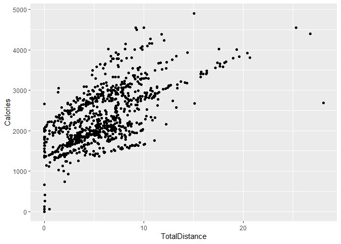

Bellabeat Case Study with R
================
Henrique Almeida
13/01/2022

This project has been done as a capstone project for the Google Data
Analytics course, completed by me at Coursera platform. The goal is to
analyze a public data from fitness tracker smart devices in order to
support the marketing strategy of Bellabeat, a high-tech manufacturer of
health-focused products for women.

## Scenario

For this project, I’m playing the role of a junior data analyst working
on the marketing analyst team at Bellabeat, a high-tech manufacturer of
health-focused products for women. Bellabeat is a successful small
company, but they have the potential to become a larger player in
theglobal smart device market. Urška Sršen, cofounder and Chief Creative
Officer of Bellabeat, believes that analyzing smart device fitness data
could help unlock new growth opportunities for the company. You have
been asked to focus on one of Bellabeat’s products and analyze smart
device data to gain insight into how consumers are using their smart
devices. The insights you discover will then help guide marketing
strategy for the company.

## Phase 1: Ask

Sršen asks you to analyze smart device usage data in order to gain
insight into how consumers use non-Bellabeat smart devices. She then
wants you to select one Bellabeat product to apply these insights to in
your presentation. These questions will guide the analysis:

1.  What are some trends in smart device usage?
2.  How could these trends apply to Bellabeat customers?
3.  How could these trends help influence Bellabeat marketing strategy?

To better structure the analysis, I’ll be answering to some questions.

What is the problem you are trying to solve?

-   Gain insights on non-Bellabeat smart device’s usage through data
    analysis in order to drive recommendations to support Bellabeat’s
    marketing strategy.

How can your insights drive business decisions?

-   If we can understand how the target audience uses health trackers
    and smart devices from other companies, we can draft marketing
    strategies that focus on the most using patterns, common situations,
    main pain points, and so on.

## Phase 2: Prepare

The data contains info about:

-   Activity
-   Calories
-   Intensities
-   Steps
-   Sleep pattern
-   weight

Installing the `tidyverse` package to analyze the data:

Loading the `tidyverse` package:

    ## -- Attaching packages --------------------------------------- tidyverse 1.3.1 --

    ## v ggplot2 3.3.5     v purrr   0.3.4
    ## v tibble  3.1.6     v dplyr   1.0.7
    ## v tidyr   1.1.4     v stringr 1.4.0
    ## v readr   2.1.1     v forcats 0.5.1

    ## -- Conflicts ------------------------------------------ tidyverse_conflicts() --
    ## x dplyr::filter() masks stats::filter()
    ## x dplyr::lag()    masks stats::lag()

Loading the data:

``` r
daily_activity <- read_csv("Fitabase Data 4.12.16-5.12.16/dailyActivity_merged.csv")
```

    ## Rows: 940 Columns: 15

    ## -- Column specification --------------------------------------------------------
    ## Delimiter: ","
    ## chr  (1): ActivityDate
    ## dbl (14): Id, TotalSteps, TotalDistance, TrackerDistance, LoggedActivitiesDi...

    ## 
    ## i Use `spec()` to retrieve the full column specification for this data.
    ## i Specify the column types or set `show_col_types = FALSE` to quiet this message.

``` r
daily_calories <- read_csv("Fitabase Data 4.12.16-5.12.16/dailyCalories_merged.csv")
```

    ## Rows: 940 Columns: 3

    ## -- Column specification --------------------------------------------------------
    ## Delimiter: ","
    ## chr (1): ActivityDay
    ## dbl (2): Id, Calories

    ## 
    ## i Use `spec()` to retrieve the full column specification for this data.
    ## i Specify the column types or set `show_col_types = FALSE` to quiet this message.

``` r
daily_intensities <- read_csv("Fitabase Data 4.12.16-5.12.16/dailyIntensities_merged.csv")
```

    ## Rows: 940 Columns: 10

    ## -- Column specification --------------------------------------------------------
    ## Delimiter: ","
    ## chr (1): ActivityDay
    ## dbl (9): Id, SedentaryMinutes, LightlyActiveMinutes, FairlyActiveMinutes, Ve...

    ## 
    ## i Use `spec()` to retrieve the full column specification for this data.
    ## i Specify the column types or set `show_col_types = FALSE` to quiet this message.

``` r
daily_steps <- read_csv("Fitabase Data 4.12.16-5.12.16/dailySteps_merged.csv")
```

    ## Rows: 940 Columns: 3

    ## -- Column specification --------------------------------------------------------
    ## Delimiter: ","
    ## chr (1): ActivityDay
    ## dbl (2): Id, StepTotal

    ## 
    ## i Use `spec()` to retrieve the full column specification for this data.
    ## i Specify the column types or set `show_col_types = FALSE` to quiet this message.

``` r
sleep_day <- read_csv("Fitabase Data 4.12.16-5.12.16/sleepDay_merged.csv")
```

    ## Rows: 413 Columns: 5

    ## -- Column specification --------------------------------------------------------
    ## Delimiter: ","
    ## chr (1): SleepDay
    ## dbl (4): Id, TotalSleepRecords, TotalMinutesAsleep, TotalTimeInBed

    ## 
    ## i Use `spec()` to retrieve the full column specification for this data.
    ## i Specify the column types or set `show_col_types = FALSE` to quiet this message.

``` r
weight_info <- read_csv("Fitabase Data 4.12.16-5.12.16/weightLogInfo_merged.csv")
```

    ## Rows: 67 Columns: 8

    ## -- Column specification --------------------------------------------------------
    ## Delimiter: ","
    ## chr (1): Date
    ## dbl (6): Id, WeightKg, WeightPounds, Fat, BMI, LogId
    ## lgl (1): IsManualReport

    ## 
    ## i Use `spec()` to retrieve the full column specification for this data.
    ## i Specify the column types or set `show_col_types = FALSE` to quiet this message.

``` r
ggplot(daily_activity, aes(TotalDistance, Calories)) + geom_point()
```

<!-- -->
